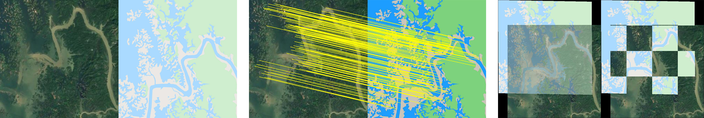

# MS-PIIFD_registration
Code for the paper “Multi-scale PIIFD for registration of multi-source remote sensing images” [Online]. Available: http://journal.bit.edu.cn/jbit/en/article/doi/10.15918/j.jbit1004-0579.2021.016. and “Multi-Scale HARRIS-PIIFD Features for Registration of Visible and Infrared Images” [Online]. Available: https://ieeexplore.ieee.org/document/9555105.

If you have any queries or suggestions, please do not hesitate to contact me (gao-pingqi@qq.com).
If you are from China, just speak Chinese, its OK~  中国人直接说中文就可以了~

Run this code by the following procedures:

1. Open and run "A_registration_main.m".
2. Set the parameters, if the procedures are clearly understood. Otherwise, use the default.
3. Choose the reference image.
4. Choose the sensed image.
5. Wait for the results.


Testing data are available:

1. MSI: https://drive.google.com/file/d/1MWttUGzkOvqT7rVaqNuvoU5fXrDuD9jh/view?usp=sharing
2. HSI: https://drive.google.com/file/d/1HZo96qHkWgJtsdWeyQXNqwYf0FUv86nH/view?usp=sharing


** Now this registration algorithm is an old-fashioned one, and we highly recommend checking our new method: MS-HLMO, which is now available at https://github.com/MrPingQi/MS_HLMO_registration.


Multi-source images registration examples:





## 📚 Citation
If you find our work useful in your research, please consider citing:
```bibtex
@article{gao2021multi,
  title={Multi-Scale {PIIFD} for Registration of Multi-Source Remote Sensing Images},
  author={Gao, Chenzhong and Li, Wei},
  journal={Journal of Beijing Institute of Technology},
  volume={30},
  number={2},
  pages={113--124},
  year={2021}
}
```
```bibtex
@inproceedings{gao2021multi,
  title={Multi-scale {Harris-PIIFD} features for registration of visible and infrared images},
  author={Gao, Chenzhong and Li, Wei},
  booktitle={2021 IEEE International Geoscience and Remote Sensing Symposium IGARSS},
  pages={5437--5440},
  year={2021},
  organization={IEEE}
}
```
