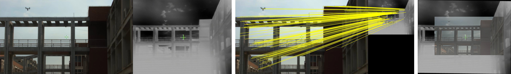
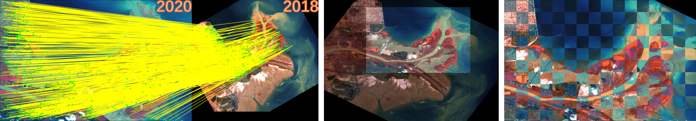
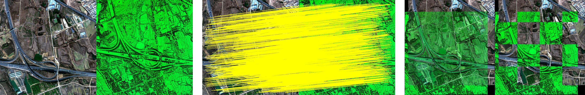
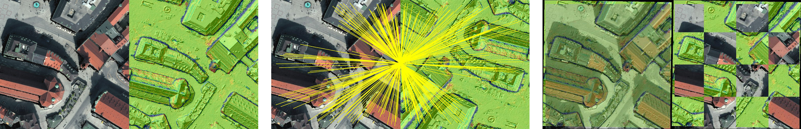

# MS-PIIFD-registration
Code for the paper “Multi-scale PIIFD for registration of multi-source remote sensing images.” [Online]. Available: http://journal.bit.edu.cn/jbit/en/article/doi/10.15918/j.jbit1004-0579.2021.016.

If you have any queries or suggestions, please do not hesitate to contact me (gao-pingqi@qq.com).

Run this code by the following procedures:

1. Open and run "a_registration_main.m".
2. Choose the reference image.
3. Choose the sensed image.
4. Wait for the results.

Testing data are available:

1. MSI: https://drive.google.com/file/d/1MWttUGzkOvqT7rVaqNuvoU5fXrDuD9jh/view?usp=sharing
2. HSI: https://drive.google.com/file/d/1HZo96qHkWgJtsdWeyQXNqwYf0FUv86nH/view?usp=sharing

** Now this registration algorithm is an old-fashioned one, and we highly recommend checking our new method: MS-HLMO, which is now available at https://github.com/MrPingQi/MS_HLMO_registration.

Multi-source images registration examples:

